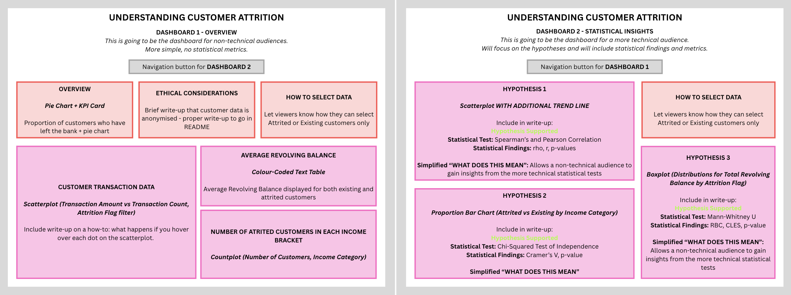

# CREDIT CARD CUSTOMER CHURN ANALYSIS

This project aims to analyse the factors contributing to whether a bank's credit card customer will churn or not. Beyond that, this project aims to present ethical considerations as a key component of this analysis.

# 

## Dataset Content

* The dataset I have chosen is [Credit Card Customers - Predicting Churning Customers](https://www.kaggle.com/datasets/sakshigoyal7/credit-card-customers/data) - a **CC0: Public Domain** dataset sourced from Kaggle. 

* The data includes the following columns:

| **Column Name** | **Description** |
| --------------- | ---------------- |
| `CLIENTNUM` | Unique client number identifier for the customer holding the account |
| `Attrition_Flag` | Whether the customer is an `Existing Customer` or an `Attrited Customer` |
| `Customer_Age` | Customer age in years |
| `Gender` | The customer's gender |
| `Dependent_count` | Number of dependents the customer has |
| `Education_Level` | The highest level of education a customer holds |
| `Marital_Status` | A customer's marital status |
| `Income_Category` | Annual income of a customer broken down into categories |
| `Card_Category` | The card product the customer holds |
| `Months_on_book` | The number of months the customer has been with the bank |
| `Total_Relationship_Count` | The total number of products held by the customer |
| `Months_Inactive_12_mon` | The number of months the customer has been inactive over the past 12 months |
| `Contacts_Count_12_mon` | The number of contacts with the bank in the last 12 months |
| `Credit_Limit` | The credit limit on a customer's credit card |
| `Total_Revolving_Bal` | The total revolving balance a customer has on their credit card |
| `Avg_Open_To_Buy` | The mean amount of unused or available credit a customer has on their credit card or revolving credit account over a one-year period |
| `Total_Amt_Chng_Q4_Q1` | The change in transaction amount (Q4 over Q1) |
| `Total_Trans_Amt` | The total transaction amount over the last 12 months |
| `Total_Trans_Ct` | The total number of transactions over the last 12 months |
| `Total_Ct_Chng_Q4_Q1` | The change in the number of transactions (Q4 over Q1) |
| `Avg_Utilization_Ratio` | The credit card utilisation ratio, which is the percentage of a customer's revolving credit that they use |

## Business Requirements

* This project addresses the following business problem: a bank manager has observed a rising rate of customers leaving their credit card services and wants to identify at-risk customers before they leave, so that the bank can proactively intervene with improved service and hopefully prevent the customers leaving.

* The aim of this project is to is to:
    * Identify which customer characteristics and behaviours are most strongly linked to attrition.
    * Evaluate whether a predictive model can flag at-risk customers in advance.

* The business requirements are as follows (each linked to a hypothesis tested as part of this project):

| **Business Requirement** | **Description** | **How is it addressed in the project?** |
| ------------------------ | --------------- | --------------------- |
| **BR1 - Understand customer spending and engagement behaviour** | The bank will need to understand customer spending and engagement habits in order to identify any customers who are disengaged (which could be linked to attrition) | This is addressed in **Hypothesis 1**, which tests the correlation of transaction amount and transaction count, alongside exploratory data analysis, which identifies different patterns for existing and attrited customers |
| **BR2 - Determine whether financial factors influence attrition** | The bank needs to know whether customer attrition is linked to broader factors like a customer's income bracket to understand who might be at risk | This is addressed in **Hypothesis 2** |
| **BR3 - Identify behavioural warning signs that precede attrition** | The bank needs to know if there are indicators in how a customer acts that might suggest they are likely to leave - for instance, the amount owed on a credit card that is unpaid at the end of the billing cyclce (Revolving Balance) | This is addressed in **Hypothesis 3** |

## Hypotheses

* The hypotheses that will be examined are:

| **Hypothesis** | **Hypothesis Description** |
| -------------- | -------------------------- |
| **H1** | Customers who make more transactions tend to spend more |
| **H2** | Annual income category is linked to whether a customer leaves the bank |
| **H3** | Customers who leave the bank have a different revolving balance than those who remain |

* They will be validated as follows:

| **Hypothesis** | **How to Validate** |
| ---- | -----|
| **H1** | Test for Normality: Shapiro-Wilk Test, Q-Q Plot Correlation Tests: Spearman and Pearson Visualisation: Seaborn Regplot with Linear Regression Line and LOWESS Regression Line |
| **H2** | Visualisation: Countplot Statistical Test: Chi-Squared Test of Independence |
| **H3** | Preliminary Descriptive Statistics: Mean and Median  Test for Normality: Q-Q Plot   Statistical Test: Mann-Whitney U Test |

## Project Plan

* Outline the high-level steps taken for the analysis.
* How was the data managed throughout the collection, processing, analysis and interpretation steps?
* Why did you choose the research methodologies you used?

## Analysis techniques used

### Stage 1 - Anonymise
    * Hashing and Salting: Applied salt and SHA-256 hashing to client numbers to anonymise the dataset before analysis.

* **Stage 2 - ETL**
    * Descriptive Statistics: analysed the mean, median, standard deviation of numerical columns using `.describe()`.
    * Data Preparation: change the data types of columns and carried out categorical column cleaning.
    * Visualisation: performed a quick visualisation of numerical columns with seaborn boxplots and histoplots.
    * IQR Analysis: identified and handled outliers in numerical columns by investigating the interquartile ranges.
    * Feature Engineering: Extracted new feature columns, `final_grade_category` and `final_grade_category`.

* **Stage 3 - EDA and Visualisation**
    * Descriptive Statistics: analysed the mean and median of final exam scores by part-time jobs status.
    * Normal Distribution Testing: performed Shapiro-Wilk test and Henze-Zirkler test for bivariate normal (both with `pinguoin`).
    * Hypothesis Testing: carried out different statistical tests (Spearman and Pearson correlation tests, Mann-Whitney U test and Chi-Squared test) and assessed the appropriate coefficient (rho, r, RBC, Cramer's V) alongside the p-value to reject or uphold the null hypothesis in each case.
    * Visualisation: created a number of visualisation types to assist in exploratory data analysis and hypothesis testing:
        * countplot
        * pie chart
        * boxplot
        * heatmap
        * regplot
        * histogram

* **Stage 4 - ML**
    * Classification Models: trained and compared two classification models to see which was most effective in predicting the target variable `Attrition_Flag_Binary`.
        * Logistic Regression: supervised machine learning algorithm used when the target is one of two possible values (in our case, `1` (Attrited Customer) or `0` (Existing Customer)).
        * Random Forest Classification: a collection of Decision Trees, which are non-linear models that capture threshold effects (where the effect suddenly kicks in) and interactions between features (when the effect of one variable depends on the value of another)
    * Train Test Split: I split the dataset into training and test sets using `scikit-learn`.
    * Preprocessing: for each mode, I used `ColumnTransformer` to apply different preprocessing steps to different features
        * `OneHotEncoder` for categorical features
        * `StandardScaler` was used to standardise numerical features
    * Pipeline: combined the preprocessing step with one of the models in a pipeline, before fitting this pipeline to the training data
    * Hyperparameters: added hyperparameters to the Random Forest Classification model to prevent overfitting (explained in more detail in **Stage 4 - ML**)
        * `class_weight="balanced"`
        * `max_depth`
        * `min_samples_leaf`
        * `min_samples_split`
    * Evaluation: evaluated each model using four metrics (explained in more detail in **Stage 4 - ML**)
        * Accuracy
        * Recall
        * Precision
        * F1 Score

## Generative AI

* I very much wanted to solidify what I'd learned myself when completing this project, so treated AI as an "assistant" to support specific troubleshooting issues or processes I was unfamiliar with. Examples of when I did this are outlined in my project under *Troubleshooting Issues* and *Notes on Process*.

## Ethical Considerations

* Any ethical considerations I made at key instances in my project have been clearly outlined in Markdown cells labelled as *Ethical Considerations*.

### Data Privacy and Anonymisation
* Customer-identifying information was anonymised at the beginning of this project (in **Stage 1 - Anonymisation**) with salting and hashing applied to the `CLIENTNUM` values before any analysis took place. This meant that no individual customer could be re-identified from the dataset used in this project, particularly given the additional step I made to `.gitignore` the original, non-anonymised file.

### Protected Characteristics and Direct Discrimination Risk
* The original dataset included several protected characteristics under the UK Equality Act 2010. I chose to deliberately exclude these from the list of features used to train the predictive models in **Stage 4 - Machine Learning**. Even though, as I outlined in a *Ethical Considerations* section in this notebook, this predictive model is for educational purposes only and should not be used on real customer data, I felt that it was important that we should not be using legally protected characteristics for any model used to determine which customers should receive differentiated treatment.

### Proxy Bias
* This is a major topic within banking machine learning. Even if you exclude protected characteristics from a model, there might be correlations that allow a model to essentially develop biases without explicitly being trained with these characteristics as features.
* In my project, I have acknowledged this limitation but have not been able to deliver a full audit: for instance, I know that I could perform disparate impact testing on different demographic subgroups - however, this felt out of reach as a possibility given the timeframe and also where my current skill levels sit, particularly with regards to machine learning. It would be very much something I'd like to learn about in the future. 

### Encoding Choices
* In **Stage 4 - Machine Learning**, I made the decision *not* to ordinally encode features like `Education_Level` and `Income_Category`. The reason I did this (and simply one-hot encoded them) is because I thought that to do so would impose biases around education attainment and income. I didn't think it was right to introduce a ranking that suggested that being in one category was "better" than another.

## Legal and Social Implications

### GDPR and Data Protection
* As I already mentioned in my **Ethical Considerations** section above, I already chose to analyse the dataset for PII and to anonymise the `CLIENTNUM` values to ensure that any customer could not be re-identified. 
* Under **Recital 26** of GDPR, data is classed as anonymous if re-identification is not "reasonably likely" and the transformation of the data from personal to anonymous must be permanent and irreversible - I hope that within the context of my project I have done this by ensuring the original raw dataset is excluded from my GitHub repository and cannot be called by running any of the Jupyter Notebooks. In reality, the raw dataset *is* available on Kaggle, but I wanted to ensure that my project handled the data as sensitively as possible.

### Social Implications
* Attrition models risk compounding existing financial vulnerabilities rather than just identifying them. Customers that have lower incomes or higher revolving balances may be more likely to be flagged by a model. However, these are the customers who most need access to banking services, support and fair treatment. The real-world impact of "model optimising" might be deprioritising customers that a bank has the strongest social responsibility towards. 
* How a prediction is used matters. For example, offering a customer a helpful retention benefit is very different from reducing their services, increasing fees, or restricting access because a model predicts they are likely to leave. Targeting vulnerable customers with aggressive marketing, higher-cost products, or incentives that encourage additional borrowing can cause harm.

### Scope and Limitations
* This project is explicitly educational in nature.
* **It has not been validated for, nor is it intended for, real-world deployment**. 
* Any real-world application of a similar predictor would need formal fairness auditing, legal review under UK GDPR and also the UK Equality Act 2010 and oversight mechanisms that have not been implemented as part of this educational project.

## Dashboard Design

* When ideating the dashboard design for this project, and given the requirement to communicate to both general *and* technical audience bases, I decided to create two linked dashboards that could serve different audiences. Dashboard 1 presents key findings for a general audience and Dashboard 2 builds on these findings, providing full statistical detail for a technical audience. 

* To ensure Dashboard 2 isn't completely inaccessible for a general audience, I have included a *WHAT DOES THIS MEAN?* section at the bottom of each hypothesis section to explain what the statistical results mean.

### Dashboard Wireframe

### Data Visualisations

* In the table below, I have outlined how the dashboards relate to each other and the business requirements for this project.

| **Business Requirement** | **Dashboard 1 (General Audience)** | **Dashboard 2 (Technical Audience)** |
| ------------------------ | ---------------------------------- | ------------------------------------ |
| **Business Problem** | KPI Card and Pie Chart | --- |
| **BR1 - Understand customer spending and engagement behaviour** | Scatterplot: Transaction Amount vs Transaction Count | Scatterplot with Linear Trend Lines: Transaction Amount vs Transaction Count (**H1**) |
| **BR2 - Determine whether financial factors influence attrition** | Countplot: Number of Attrited Customers per Income Category | Proportional Stacked Bar Chart: Attrited vs Existing Customers per Income Category (**H2**) |
| **BR3 - Identify behavioural warning signs that precede attrition** | Text Table: Average Total Revolving Balance | Boxplots: Revolving Balances of Attrited vs Existing Customers (**H3**) |

### Rationale: Choice of Data Visualisations for Business Requirements

#### **Dashboard 1 - Overview (for a non-technical audience)**

| **Visualisation** | **Requirement Addressed** | **Rationale** |
| ----------------- | ------------------------- | ------------- |
| **KPI Card: Attrited customers** | Establishes the scale of the business problem - 16% of customers have left the bank | The headline attrition rate is a really important number in the project because the number justifies the business need in the first place. I chose a KPI card because it doesn't need interpretation, which is appropriate for a non-technical audience. |
| **Pie Chart: Attrited vs Existing Customers** | Establishes the scale of the business problem. | When paired with the KPI card, the pie chart gives the audience a sense of the proportionality between the existing and attrited customers. |
| **Scatterplot: Transaction Amount vs Transaction Count** | This addresses the first business requirement: understanding customer spending and engagement. | A scatterplot means we can visualise engagement at a customer level. Colour-coding the scatterplot by `Attrition_Flag` will allow a non-technical audience to visually notice that attrited customers tend to cluster lower with needing a statistical explanation. |
| **Countplot: Number of Attrited Customers per Income Category** | This addresses the second business requirement: determining whether financial factors influence attrition. | I chose a countplot because it would give a non-technical audience a clear sense of any concentration of attrited customers in specific income categories in straightforward terms (number of) rather than as a statistical proportion. |
| **Text Table: Average Total Revolving Balance** | This looks at the third business requirement: identifying behavioural warning signs before a customer leaves. | A simple table was chosen over a chart here because the finding is best communicated via a simple, single-number average. This is appropriate for a non-technical audience because it is direct and unambiguous. |

#### **Dashboard 2 - Statistical Insights (for a more technical audience)**

| **Visualisation** | **Requirement Addressed** | **Rationale** |
| ----------------- | ------------------------- | ------------- |
| **Scatterplot with Linear Trend Lines: Transaction Amount vs Transaction Count** | This addresses the first business requirement (tested formally in Hypothesis 1) | I decided to use the same scatterplot that was used in Dashboard 1 to keep consistency and to help with comparability. I added linear trend lines (one per `Attrition_Flag` group) to give a technical audience a visual guide that supports the correlation test coefficients being reported (r and rho). |
| **Proportional Stacked Bar Chart: Attrited vs Existing Customers per Income Category** | This addresses the second business requirement (tested formally in Hypothesis 2) | For a more technical audience, I chose a stacked proportional bar chart over a simple countplot because this is a closer representation of what we tested when performing the Chi-Squared Test, which is looking at association. It acts as a direct visualisation of the association between existing and attrited customers that we found when performing the statistical test and returning Cramer's V. |
| **Boxplots: Revolving Balances of Attrited vs Existing Customers** | This addresses the third business requirement (tested formally in Hypothesis 3) | The boxplots give a technical audience the full distribution detail behind the results found by carrying out the Mann-Whitney U Test. For a technical audience, being able to communicate the pronounced skew towards $0.00 for attrited customers is a really important takeaway. |

### Dashboard Deployment

* The link to the dashboard created in Tableau can be found here: [Credit Card Customers Churn Analysis Dashboard](https://public.tableau.com/app/profile/ellie.hope/viz/credit-card-customer-churn-analysis/Dashboard1-Overview)

## Unfixed Bugs

* In the three Jupyter Notebooks, I have found that sometimes the visualisations don't show up if you click *Run All*. If this happens, please manually run the cell again and the plots should appear.

## Development Roadmap and Reflection on Learning Journey

* I am incredibly proud of the learning journey I have had over the course of the last four months and it feels incredibly surreal to think that I have actually put this final capstone project together. What has been nice about this final one is that I can see learnings taken from the subsequent two projects have been amalgamated in this final one. 

### Machine Learning
* I was able to see a real improvement in my own understanding of how to develop a pipeline, fit it, and then evaluate the results. 
* I am really pleased because this time around I was able to identify an issue (the Random Forest model was initially overfitted) and alter the preprocessing steps with hyperparameters to achieve better model performance the second time around.

### Ethical Considerations
* I found applying an ethics lens to this project a really interesting exercise and I am keen to continue to learn about ethics and legal considerations in data analytics moving forwards.
* I also really enjoyed picking up the salting and hashing techniques I learnt about in the first project and applying them here.

### Challenges Faced and How I Overcame
* I do not come from a background in Finance, so there was a lot of learning that needed to take place into what the columns actually meant before I could go ahead and analyse (it is essential that you know your data!). I found this process really enjoyable, because it meant I gained knowledge in a new field that I might be able to apply in future.
* In comparison to the last dataset, this one contained far more variables. This brought up two main challenges that I had to overcome:
    * Picking a focus: it was critical that I ensured the project and the resulting dashboard told a story and I didn't simply choose things to analyse at random. With the dashboards, I made a concerted effort to reflect information that was only related to my original business requirements.
    * Quantity: The way I have tackled sections is quite lengthy, often tackling each individual column separately (for instance, the **Handle Outliers** section in (**Stage 2 - ETL**). In future, I would like to get better at combining analysis steps to streamline the project).

## Main Data Analysis Libraries

### Stage 1 - Anonymise
* os
* pandas
* hashlib
* python-dotenv

### Stage 2 - ETL
* os
* numpy
* pandas
* matplotlib
    * .pyplot
* seaborn

### Stage 3 - EDA and Visualisation
* os
* numpy
* pandas
* matplotlib
    * .pyplot
* seaborn
* pinguoin
* scipy

### Stage 4 - Machine Learning
* os
* numpy
* pandas
* matplotlib
    * .pyplot
* seaborn
* sklearn
    * .pipeline - Pipeline
    * .compose - ColumnTransformer
    * .preprocessing - OneHotEncoder, StandardScaler
    * .linear_model - LogisticRegression
    * .ensemble - RandomForestClassifier
    * .metrics - accuracy_score, precision_score, recall_score, f1_score, confusion_matrix

## Credits

* In all sections, I have included Markdown cells entitled *Troubleshooting Issues* and *Notes on Process*: where I have used blogposts/ articles, official documentation or generative AI to support me in troubleshooting issues or in assisting me to complete a process I might not have seen before, I have included references to this within the notebooks themselves in these cells. However, please see below for a full list of credits.

### Stage 1 - Anonymise
* Medium.com - [Pandas Move Column to Front](https://medium.com/@amit25173/pandas-move-column-to-front-3-simple-steps-to-organize-your-dataframe-99bf1f2d39aa)
* Medium.com - [Anonymise Sensitive Data in a Pandas DataFrame Column with hashlib](https://medium.com/data-science/anonymise-sensitive-data-in-a-pandas-dataframe-column-with-hashlib-8e7ef397d91f)
* I used **Microsoft Copilot's inline suggestions** to support me in writing the lines of code with `os.getenv`.

### Stage 2 - ETL
* The write-up of **Core Statistical Concepts** came from learnings taken from the LMS.
* Credit to Rory from Code Institute for the **D-I-S-H** acronym and for taking us through a step-by-step process for ETL, particularly with regards to IQR analysis for handling outliers.

### Stage 3 - Visualisation
* The following Stack Overflow forms were incredibly helpful for this section:
    * [How to change the colours of a Q-Q plot](https://stackoverflow.com/questions/37463189/change-marker-style-color-in-python-probplot)
    * [How to rotate x-tick labels](https://stackoverflow.com/questions/10998621/rotate-axis-tick-labels)
    * [Countplot with normalised y-axis per group](https://stackoverflow.com/questions/34615854/countplot-with-normalized-y-axis-per-group)
    * [Display bar labels on a seaborn barplot](https://stackoverflow.com/questions/55104819/display-count-on-top-of-seaborn-barplot)
* I consulted the following official documentation:
    * [Matplotlib Documentation](https://matplotlib.org/stable/api/_as_gen/matplotlib.pyplot.legend.html) for `.legend` to move the legend in the Gender plot to allow viewers to see the top of the bar
    * [SciPy Shapiro Documentation](https://docs.scipy.org/doc/scipy/reference/generated/scipy.stats.shapiro.html) helped me to troubleshoot a UserWarning I got when running a Shapiro-Wilk Test (dataset was too large)
    * [Seaborn Documentation](https://seaborn.pydata.org/generated/seaborn.move_legend.html) helped me to move the hue legend which was covering the top of my bar chart
* Specific cases where Generative AI assisted me:
    * Establishing the correct order for my method chaining to create proportion bar charts
    * In finding `.pivot()` to print all proportions in a table (printing values on the bars in bar plots was too messy)
    * Suggested alternative ways of ascertaining whether the data is normal - namely that of visualising the data in a Q-Q plot alongside histograms

### Stage 4 - ML
* In this section, I predominantly used the Code Institute LMS content, and must give particular credit to the instructions on how to create a pipeline with a custom method that combined the preprocessing steps and the pipeline itself.
* Additionally, I used Generative AI (Claude Sonnet 5), to provide me with a simplified breakdown of all the steps in a machine learning pipeline to help my understanding. One of the additional tools I was able to learn about was `ColumnTransformer`.
* In addition to what I had learned in my previous project, consulting Generative AI (Claude Sonnet 5) led me to various hyperparameters that I was able to apply to my unconstrained Random Forest model and prevent overfitting. These hyperparameters are all listed below and I have included a write-up in **Stage 4 - ML** that gives an overview of what they all do:
    * `class_weight="balanced"`
    * `max_depth`
    * `min_samples_leaf`
    * `min_samples_split`

### Media

* The image used in this README.md is from Code Institute.

## Acknowledgements

* Thank you to everyone from the Code Institute team who have been instrumental in my learning throughout this course. I feel very grateful to have had the opportunity to have learnt so much and in what feels like such a short amount of time.
* Thanks to my great cohort!
